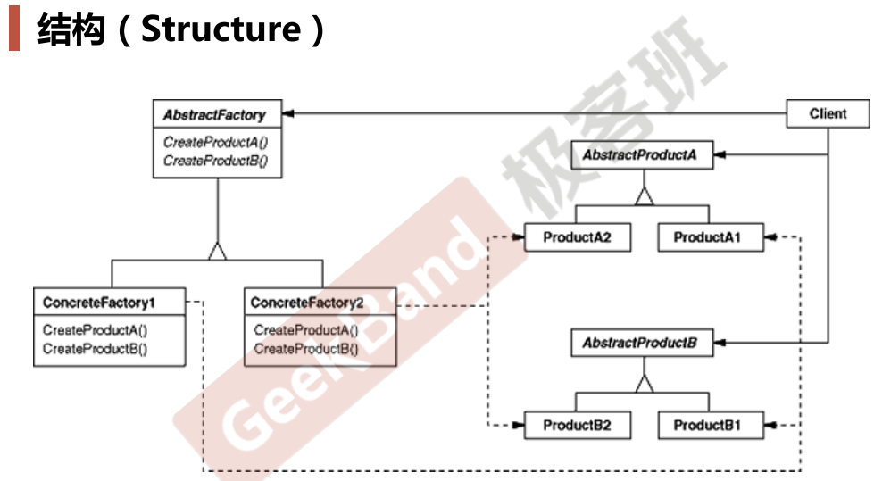

### 动机

* 在软件系统中，经常面临着“**一系列相互依赖的对象”的创建工作**；同时，由于需求的变化，往往存在更多系列对象的创建工作。
* 如何应对这种变化？如何绕过常规的对象创建方法(new)， **提供一种“封装机制”来避免客户程序和这种“多系列具体对象创建工作” 的紧耦合**？

### 案例

* 数据访问层
* 访问数据库需要定义系列对象（比如connection、command、reader，其中command依赖connection），然而可能访问各种类型的数据库，即需要定义多系列的对象（比如mysql的connection对象就需要和mysql的command对象搭配，而不能和oracle的command对象搭配）。
* 如果只需要mysql数据库，那工厂模式就够用了，而考虑到需要处理其它类型的数据库，所以才需要用Abstract Factory
* 注：connection、command、reader只用1个factory就可以了，因为三者本来就很相关，那就应该是高内聚的，所以这个模式更应该叫做“组工厂”之类的

### 模式定义

* 提供一个接口，让**该接口负责创建一系列“相关或者相互依赖的对象”**，无需指定它们具体的类

### 模式结构

### 要点总结

* 如果没有应对“多系列对象构建”的需求变化，则没有必要使用Abstract Factory模式，这时候使用简单的工厂完全可以。
* 系列对象”指的是在某一特定系列下的对象之间有相互依赖或作用的关系。不同系列的对象之间不能相互依赖。
* Abstract Factory模式主要在于应对“新系列”的需求变动。其缺点在于难以应对“新对象”的需求变动。

### 代码

https://github.com/chouxianyu/design-patterns-cpp/tree/master/AbstractFactory
