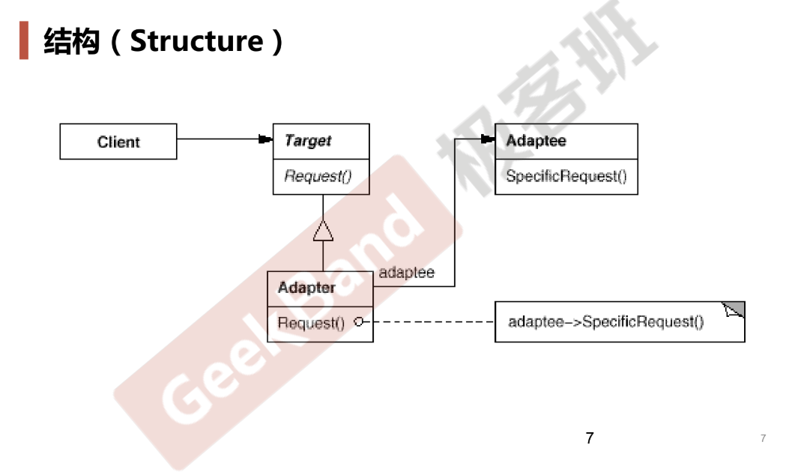

# Adapter

## 动机

* 在软件系统中，由于应用环境的变化，常常需要将“一些现存的对象”放在新的环境中应用，但是新环境运行的接口是这些现存对象所不满足的
* 如何应对这种“迁移的变化”？要求既能**用现有对象的实现**，同时又能**满足新的应用环境所要求的接口**

## 模式定义

* 将一个类的接口转换成客户希望的另一个接口，使得原本由于接口不兼容而不能一起工作的类可以一起工作

## 结构

* Adapter继承Target（新接口），组合1个Adaptee（现存接口）对象

## 要点总结

* Adapter模式主要应用于“希望复用一些现存的类，但是接口又与复用环境要求不一致时的情况”，在遗留代码复用、类库迁移等方面非常有用
* GoF23定义了两种Adapter结构：
  * 类适配器（实现方法是多继承，public继承表示符合你这个接口的规范，protected/private继承表示实现继承，因为并不继承你的接口但我却用你的实现），类适配器不够灵活（甚至说只有坏处没有好处）
  * 对象适配器（实现方法是继承+组合）
* Adapter模式其实非常灵活，不必拘泥于GoF23定义的两种结构。比如可以直接将现存对象作为新的接口方法的参数，来达到适配的目的
* 注：学习设计模式不能太死板，比如觉得代码必须和GoF的代码一样，但其实设计模式存在变体、软件系统存在不同差异，还是需要上升到设计原则和设计思想

## 代码

https://github.com/chouxianyu/design-patterns-cpp/tree/master/Adapter
