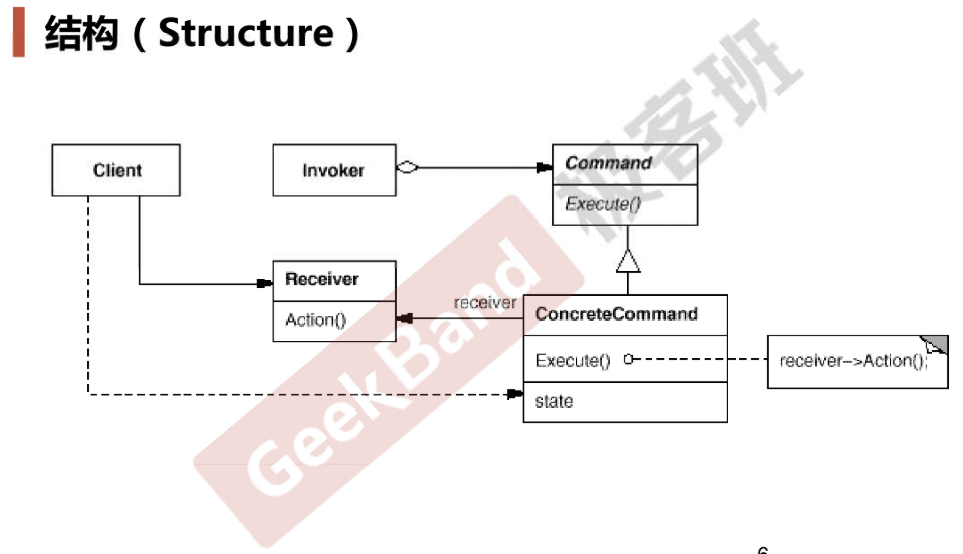

### 动机

* 在软件构建过程中，“行为请求者”与“行为实现者”通常呈现一种“紧耦合”。但在某些场合—比如需要对行为进行“记录、撤销/重  (undo/redo)、事务”等处理，这种无法抵御变化的紧耦合是不合适的。
* 在这种情况下，如何**将“行为请求者”与“行为实现者”解耦？将一组行为抽象为对象，可以实现二者之间的松耦合**。

### 模式定义

将一个请求（行为）封装为一个对象，从而使你可用不同的请求对客户进行参数化；对请求排队或记录请求日志，以及支持可撤销的操作。

### 结构

### 要点总结

* Command模式的根本目的在于将“行为请求者”与“行为实现者”解耦，在面向对象语言中，常见的实现手段是“**将行为抽象为对象**”。
* 实现Command接口的具体命令对象ConcreteCommand有时候根据需要可能会保存一些额外的状态信息。通过使用Composite模式  可以将多个“命令”封装为一个“复合命令”MacroCommand。
* Command模式与C++中的函数对象有些类似。但两者定义行为接口的规范有所区别：Command以面向对象中的“接口-实现”来定义行为接口规范，更严格，但有性能损失；C++函数对象以函数签名来定义行为接口规范，更灵活，性能更高。
* 注：对象和行为直接的绑定不管是编译时绑定还是运行时绑定（通过多态和虚函数表），都是紧耦合
* 注：94年还没有函数对象和泛型编程，现在来看的话，两者非常类似，甚至在某些场合下函数对象会优于Command模式，现在函数对象也应用的更多（因为C++往往是应用在性能要求较高的场景中）

### 代码

https://github.com/chouxianyu/design-patterns-cpp/tree/master/Command
