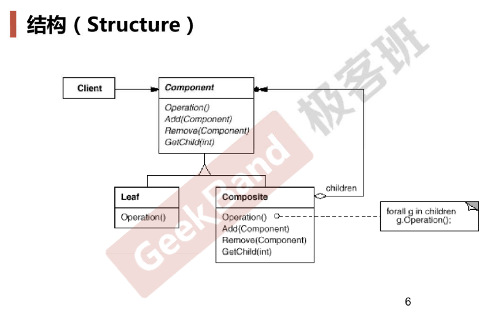

# Composite

## 动机

* 某些情况下，客户代码过多依赖于**对象容器**复杂的内部实现结构，对象容器内部实现结构的变化将引起客户代码的频繁变化
* 如何将客户代码与复杂的对象容器解耦？让对象容器自己来实现自身的复杂结构，从而使得客户代码像处理简单对象一样来处理复杂对象？

## 模式定义

* 将对象组合成树形结构，表示“部分-整体”的层次结构。使得用户对单个对象和组合对象的使用具有一致性（稳定）

## 案例

* 通过组合+继承形成树形结构中的结点，定义Component基类，通过多态调用不同类型结点的方法

## 结构

## 要点总结

* Composite模式使用树形结构来实现普遍存在的对象容器，从而将“一对多”的关系转化为“一对一”的关系，使得**客户代码可以一致地（复用）处理对象和对象容器**，无需关心处理的是单个的对象，还是组合的对象容器
* 将客户代码与复杂的对象容器结构解耦是Composite模式的核心，解耦后，客户代码将与纯粹的抽象接口（而非对象容器的内部实现）发生依赖，从而更能“应对变化”
* Composite模式在具体实现中，可以让父对象中的子对象反向追溯；如果父对象有频繁的遍历需求，可使用缓存技巧来改善效率

## 代码

https://github.com/chouxianyu/design-patterns-cpp/tree/master/Composite
