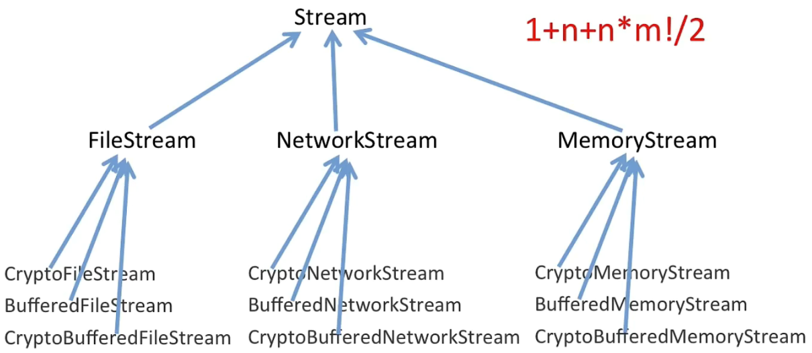
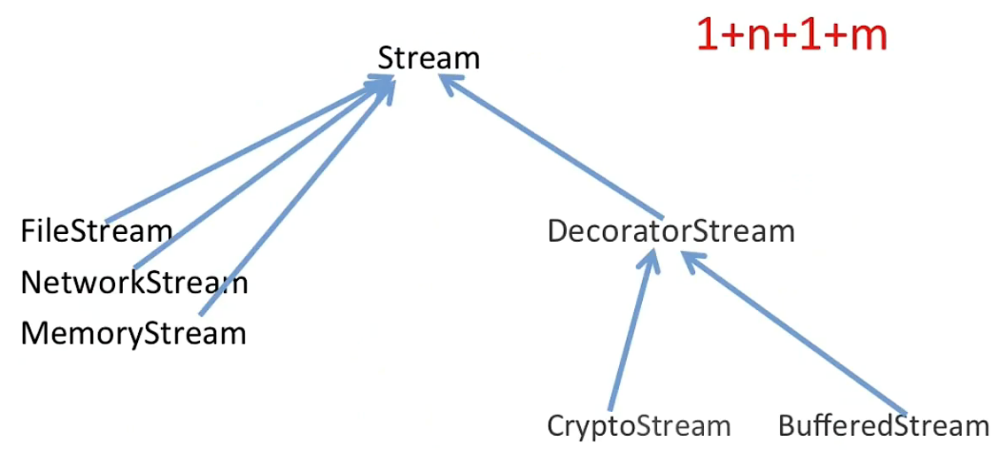
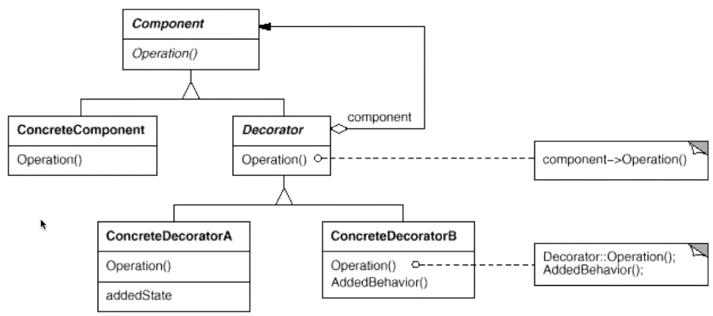

### 动机

* 在某些情况下我们可能会“**过度地使用继承**来扩展对象的功能”， 由于继承为类型引入的静态特质，使得 **这种扩展方式缺乏灵活性** ； 并且随着子类的增多（扩展功能的增多），各种子类的组合（扩展 功能的组合）会导致更多子类的膨胀
* 注：继承是一种静态关系，随着功能扩展，**过度继承（对继承的不良使用）会导致子类过多、灵活性降低、代码复用度降低**

### 案例

* 案例：流，比如文件流、内存流、网络流，现在需要定义加密文件流、加密内存流、加密网络流，当然不只是加密，还可以缓冲、加密+缓冲

* 思路
  * 组合优于继承
  * 绝大多数设计模式的真谛：让代码在编译时是复用的，而通过多态和组合在运行时支持变化
  * 组合（用基类指针作为1个成员变量）+ 多态
  * **decorator其实就是依赖于某个实体并对该实体进行“扩展”** ，比如对文件流/网络流进行加密/缓冲就是一种扩展、而文件流相对于流则不是一种decorator

### 模式定义

 **动态（组合）地给一个对象增加一些额外的职责** 。就增加功能而言，Decorator模式比生成子类（继承）更为灵活（消除重复代码 & 减少子类个数）。

### 模式结构

### 要点总结

* 通过采用组合而非继承的手法， Decorator模式实现了在运行时动态扩展对象功能的能力，而且可以根据需要扩展多个功能。避免 了使用继承带来的“灵活性差”和“多子类衍生问题
* Decorator类在接口上表现为is-a Component的继承关系，即Decorator类继承了Component类所具有的接口。但在实现上又表现为has-a Component的组合关系，即Decorator类又使用了另外一个Component类
* Decorator模式的目的并非解决“多子类衍生的多继承”问题， Decorator模式应用的要点在于解决“主体类在多个方向上的扩展功能”——是为“装饰”的含义。

### 代码

https://github.com/chouxianyu/design-patterns-cpp/tree/master/Decorator
