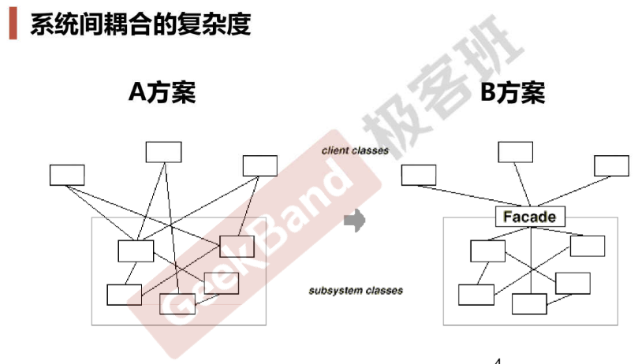
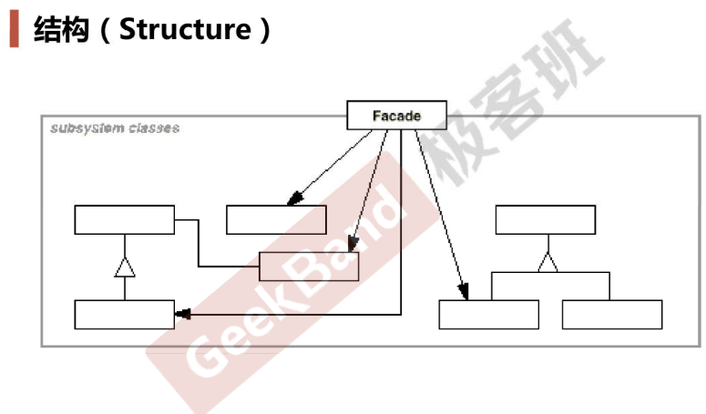

# Facade

## 动机

* A方案的问题在于组件的客户和组件中各种复杂的子系统有了过多的耦合，随着外部客户程序和各子系统的演化，这种过多的耦合面临很多变化的挑战
* 如何简化外部客户程序和系统间的交互接口？如何将外部客户程序的演化和内部子系统之间的变化之间的依赖相互解耦？

## 模式定义

* 为子系统中的一组接口提供一个一致（稳定）的界面/高层接口，使得子系统更易复用
* 注：其实Facade里并不是c，是个法文单词，翻译过来是“门面”
* ## 结构

Facade模式没有特定的代码结构，它更多是一种思想和架构设计模式

## 要点总结

* 从客户程序的角度来看，Façade模式简化了整个组件系统的接口，对于组件内部与外部客户程序来说，达到了一种”解耦“的效果——内部子系统的任何变化不会影响到Façade接口的变化。
* Façade设计模式更注重从架构的层次去看整个系统，而不是单个类的层次。Façade很多时候更是一种架构设计模式。
* Façade设计模式并非一个集装箱，可以任意地放进任何多个对象。Façade模式组件的内部应该是“相互耦合关系比较大的一系列组件”，而不是一个简单的功能集合。

## 代码

[https://github.com/chouxianyu/design-patterns-cpp/tree/master/Facade](https://github.com/chouxianyu/design-patterns-cpp/tree/master/Facade)
