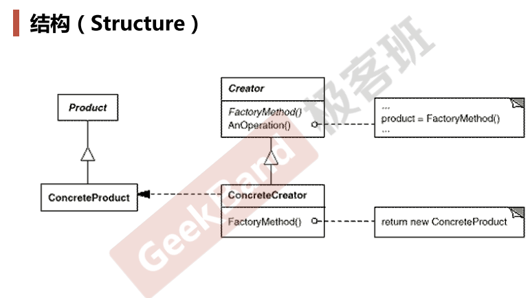

### 动机

* 在软件系统中，经常面临着创建对象的工作；由于需求的变化，需要**创建的对象的具体类型经常变化。**
* 如何应对这种变化？如何**绕过常规的对象创建方法(new)**，提供一种“封装机制”来避免客户程序和这种“具体对象创建工作”的紧耦合？

### 案例

文件分割Splitter

详见[design-patterns-cpp/Observer.md at master · chouxianyu/design-patterns-cpp (github.com)](https://github.com/chouxianyu/design-patterns-cpp/blob/master/docs/Observer.md)

### 模式定义

* **定义一个用于创建对象的接口**（纯虚基类）**，让子类决定实例化哪一个类**。 Factory使得一个类的实例化延迟（目的：解耦， 手段：虚函数）到子类
* 注：自定义1个纯虚工厂基类，其中有个虚方法，它返回我们想要的具体对象，具体实现由具体的工厂子类（工厂子类继承纯虚工厂父类）实现。

### 模式结构

### 要点总结

* Factory模式用于隔离类对象的使用者和具体类型之间的耦合关系。面对一个经常变化的具体类型，紧耦合关系(new)会导致软件的脆弱。
* Factory Method模式通过面向对象的手法，将所要创建的具体对象工作延迟到子类，从而实现一种扩展（而非更改）的策略，较好地解决了这种紧耦合关系。
* Factory Method模式解决“单个对象”的需求变化。缺点在于要求创建方法/参数相同。

### 代码

https://github.com/chouxianyu/design-patterns-cpp/tree/master/Factory
