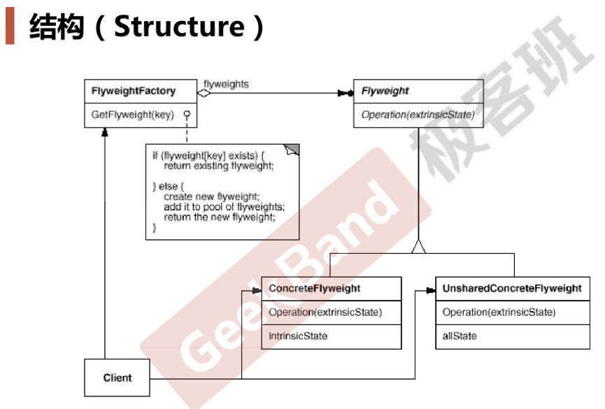

# Flyweight

## 动机

* 系统中存在大量（几万个、几十万个，这个量也是相对的）细粒度的对象（字符串、字体、线程等等）时，会带来很高的运行时代价（主要指内存需求方面的代价）.
* 之前有过“一切皆对象”的思潮，但发现并不好，因为1个int、double没必要搞成对象，反而浪费了资源，那怎么办呢？就不用对象了吗，不是，我们需要新的机制
* 如何在避免大量细粒度对象的情况下，让外部客户程序仍然能透明地使用面向对象的方式来操作？

## 案例

* 比如Font类（字体），对于黑体我们没必要创建大量黑体对象，所以我们让各个字、句子共享同1个黑体对象，所以看起来这个模式和单例模式非常相似
* Font类、FontFactory（里面有个对象池，如果想要的对象不存在则创建1个并将其加入到对象池，如果存在则直接返回）
* 其实Java、C#在编译时就实现了一种Flyweight，比如字符串池、线程池

## 模式定义

* 运用共享技术有效支持大量细粒度对象

## 结构

## 要点总结

* 面向对象很好地解决了抽象性的问题，但是作为运行在机器中的程序实体，我们需要考虑对象的代价问题。Flyweight主要解决面向对象的代价问题，一般不触及面向对象的抽象性问题。
* Flyweight采用对象共享的做法来降低系统中对象的个数，从而降低细粒度对象给系统带来的内存压力。在具体实现方面，要注意对象状态的处理。
* 对象的数量太大从而导致对象内存开销加大——什么样的数量才算大？这需要我们仔细的根据具体应用情况进行评估，比如到底占用了多少内存？sizeof、考虑字长、考虑字节对齐、考虑虚函数（虚函数表指针占用多少），而不能凭空臆断。
* 注：Flyweight模式要求这些对象是只读的，比如Java里字符串就是只读的，但C++里字符串不是只读的（利用的proxy实现copy on right）

## 代码

[https://github.com/chouxianyu/design-patterns-cpp/tree/master/Flyweight](https://github.com/chouxianyu/design-patterns-cpp/tree/master/Flyweight)
