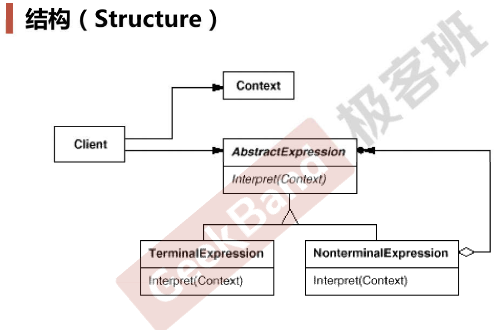

### 动机

* 在软件构建过程中，如果某一特定领域的问题比较复杂，类似的结构不断重复出现，如果使用普通的编程方式来实现将面临非常频繁的变化。
* 在这种情况下，将特定领域的问题表达为某种语法规则下的句子，然后构建一个解释器来解释这样的句子，从而达到解决问题的目的。

### 案例

* 加减运算表达式，定义表达式纯虚基类、变量表达式类、运算表达式类、加法表达式类（继承运算符表达式类）、减法表达式类（继承运算符表达式类）。
* 类似的案例还有中文数字，比如“一千三百五十六”

### 模式定义

给定一个语言，定义它的文法的一种表示，并定义一种解释器，这个解释器使用该文法表示来解释语言中的句子。

### 结构

### 要点总结

* Interpreter模式的应用场合是Interpreter模式应用中的难点，只有满足“业务规则频繁变化，且类似的结构不断重复出现，并且容易抽象为语法规则的问题”才适合使用Interpreter模式。其中“业务规则频繁变化”指的是表达式有无数个
* 使用Interpreter模式来表示文法规则，从而可以使用面向对象技巧来方便地“扩展”文法。
* Interpreter模式比较适合简单的文法表示，对于复杂的文法表示，Interperter模式会产生比较大的类层次结构，需要求助于语法分析生成器这样的标准工具。

### 代码

https://github.com/chouxianyu/design-patterns-cpp/tree/master/Interpreter
