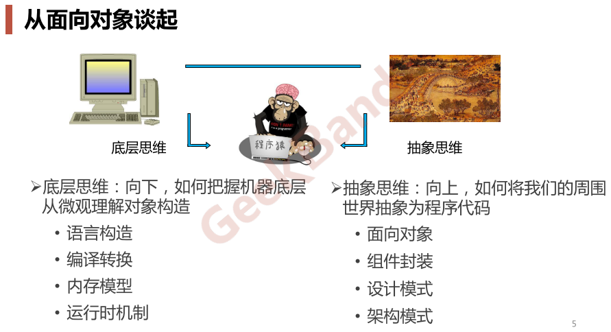

# Introduction

## 程序员的两种思维

* **底层思维**：向下，如何把握机器底层从微观理解对象构造
  * 语言构造
  * 编译转换
  * 内存模型
  * 运行时机制
* **抽象思维**：向上，如何将我们的周围世界抽象为程序代码
  * 设计模式
  * 面向对象
  * 组件封装
  * 架构模式

## 软件设计复杂的根本原因：变化

* 客户需求的变化
* 技术平台的变化
* 开发团队的变化
* 市场环境的变化
* ……

## 解决复杂性的两种方法

* **分解**：
  * 思路：分而治之，将大问题分解为多个小问题，将复杂问题分解为多个简单问题。
  * 缺点：复用性低，对于新的需求需要做新的处理
* **抽象**：
  * 思路：由于不能掌握全部的复杂对象，我们选择忽视它的非本质细节而去处理泛化和理想化了的对象模型。
  * 优点：统一管理，局部自治/各司其职，复用性高，对于新的需求，不影响原来各个部分的责任和功能

## 软件设计的目标：复用

* 设计模式的目标：管理变化，提高复用
  * 把设计模式用到不适用的场景是不行的
  * 把设计模式应用到没有必要的场景是不行的
  * ……
* 要基于需求变化、时间轴的概念去思考代码设计好和不好
* 设计模式的好处不只是清晰什么的，对于编译甚至也是好的，比如开放封闭原则，如果你在面对新需求时不断修改之前的实现，那之前的代码就需要重新编译，如果面对新需求只需要进行扩展、不需修改之前的代码文件，这样就可以实现增量编译，减少编译时间。虽然说你修改之前实现可以是在原有代码之后加个ifelse，不修改之前实现，这个理想很美丽，但实际上你去在原代码后面添加代码时会发现经常需要修改前面的代码
* 真正的复用性是编译单元的复用性

## 重构获得模式（Refactoring to Patterns）

* 面向对象设计模式是“好的面向对象设计”，所谓“好的面向对象设计”指是那些可以满足 “应对变化，提高复用”的设计 。
* 现代软件设计的特征是“需求的频繁变化”。设计模式的要点是“寻找变化点，然后在变化点处应用设计模式，从而来更好地应对 需求的变化”.“什么时候、什么地点应用设计模式”比“理解设 计模式结构本身”更为重要。
* 设计模式的应用不宜先入为主，一上来就使用设计模式是对设计模式的最大误用。没有一步到位的设计模式。敏捷软件开发实践提倡的“Refactoring to Patterns”是目前普遍公认的最好的使用设计模式的方法。
