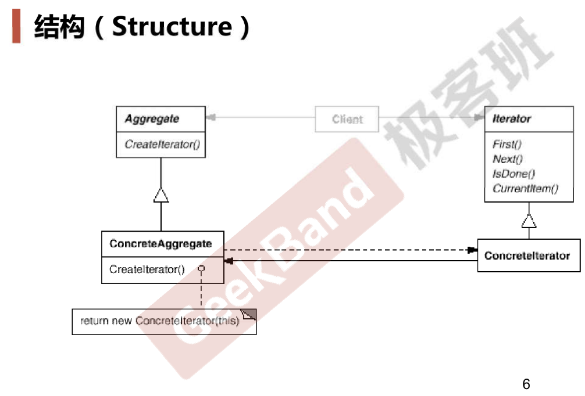

# Iterator

## 动机

* 在软件构建过程中，集合对象内部结构常常变化各异。但对于这些集合对象，我们希望在不暴露其内部结构的同时，可以让外部客户代码透明地访问其中包含的元素；同时这种“透明遍历”也为“同一  种算法在多种集合对象上进行操作”提供了可能。
* 使用面向对象技术**将这种遍历机制抽象为“迭代器对象”为“应对变化中的集合对象”**提供了一种优雅的方式。

## 模式定义

* 提供一种方法顺序访问一个聚合对象中的各个元素，而又不暴露(稳定)该对象的内部表示。

## 结构

## 要点总结

* 迭代抽象：访问一个聚合对象的内容而无需暴露它的内部表示。
* 迭代多态：为遍历不同的集合结构提供一个统一的接口，从而支  特同样的算法在不同的集合结构上进行操作
* 迭代器的健壮性考虑：遍历时更改迭代器所在的集合结构，会导致问题
* 注：在C++中使用面向对象的方式实现迭代器模式已经过时了，现在C++泛型编程已经实现了迭代器模式。而虚函数调用是需要成本的，面向对象中的多态是运行时多态，而模板中的多态是编译时多态（在编译时自行确定某些东西），运行时多态的成本是高于编译时多态的。但其它语言比如Java等，不支持编译时多态、模板，所以还是在使用基于面向对象的迭代器模式的

## 代码

[https://github.com/chouxianyu/design-patterns-cpp/tree/master/Iterator](https://github.com/chouxianyu/design-patterns-cpp/tree/master/Iterator)
