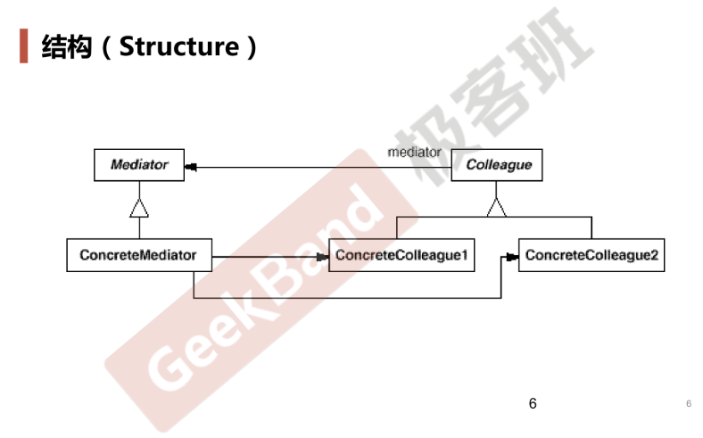

# Mediator

## 动机

* 在软件构建过程中，经常出现多个对象互相关联交互的情况，对象之间常常会维持一种复杂的引用关系，如果遇到一些需求的更改，这种直接的引用关系将面临不断的变化
* 在这种情况下，我们可以**使用一个“中介对象”来管理对象之间的关联关系**，避免相互交互的对象之间的紧耦合引用关系，从而更好地抵御变化

## 案例

* 界面和控件、控件和DataModel，可以使用DataBind类型，也会用到观察者模式

## 模式定义

* 用1个中介对象来封装（封装变化）一系列的对象交互，**中介者使各对象不需要显式地相互引用**（编译时依赖=>运行时依赖），从而使其耦合松散（管理变化），而且可以独立地改变它们之间的交互

## 结构

* Colleague（基类）组合了1个Mediator（基类）指针
* ConcreteMediator中组合了多个子类ConcreteColleague指针

## 要点总结

* Mediator模式将多个对象间复杂的关联关系和控制关系解耦并进行集中管理，变“多个对象相互关联”为“多个对象和一个中介者关联”，简化了系统的维护，抵御了可能的变化
* 随着控制逻辑的复杂化，Mediator具体对象的实现可能相当复杂，这时候可以对Mediator对象进行分解处理
* Facade模式是解耦系统间（单向）的对象关联关系；Mediator模式是解耦系统内各个对象之间（双向）的关联关系
* 注
  * “多个”、“复杂”，是需要具体衡量的
  * 在实现这个模式时，需要定义出一种“消息机制”使得不同对象良好交互

## 代码

[https://github.com/chouxianyu/design-patterns-cpp/tree/master/Mediator](https://github.com/chouxianyu/design-patterns-cpp/tree/master/Mediator)
