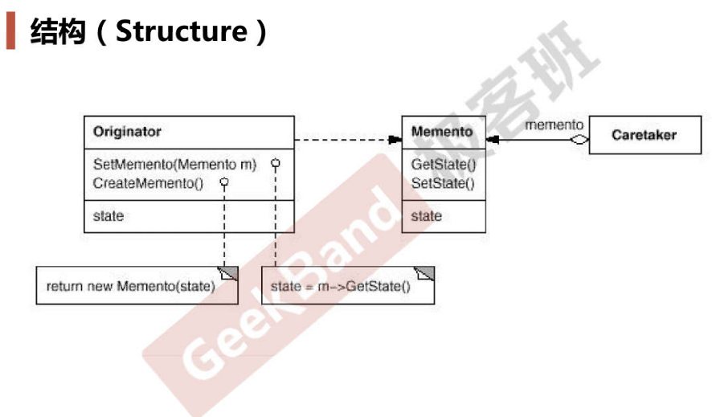

# Memento

## 动机

* 在软件构建过程中，某些对象的状态在转换过程中，可能由于某种需要，要求程序能够回溯到对象之前处于某个点时的状态（比如对象及的redo、undo操作）。如果使用一些公共接口来让其它对象得到对象的状态，便会暴露对象的细节实现
* 如何**实现对象状态的良好保存与恢复**？但同时又不会因此而破坏对象本身的封装性

## 模式定义

* 在不破坏封装性的前提下，捕获一个对象的内部状态，并在该对象之外保存这个状态，这样以后就可以将该对象恢复到原先保存的状态

## 结构

* 定义1个Memento类，其包括两个方法getState和setState，其state的实现可以和Originator中的state实现不同，比如为了高效存储使用一些序列化技术
* 还有1个Originator类，其包括两个方法createMomento（将自身的state作为参数传递给Momento的构造函数，创建Momento对象并返回）和setMomento（参数为Momento对象，会调用Momento类的getState方法）

## 要点总结

* **备忘录（Memento）存储原发器（Originator）对象的内部状态，在需要时恢复原发器状态**
* 备忘录模式的核心是信息隐藏，即**Originator既需要向外界隐藏信息、保持封装性，又需要将状态保持到外界（Memento）**
* 现代运行时语言（C#、Java等）都具有相当的对象序列化支持，因此往往采用效率更高、又较容易正确实现的序列化方案来实现备忘录模式

## 代码

[https://github.com/chouxianyu/design-patterns-cpp/tree/master/Memento](https://github.com/chouxianyu/design-patterns-cpp/tree/master/Memento)
