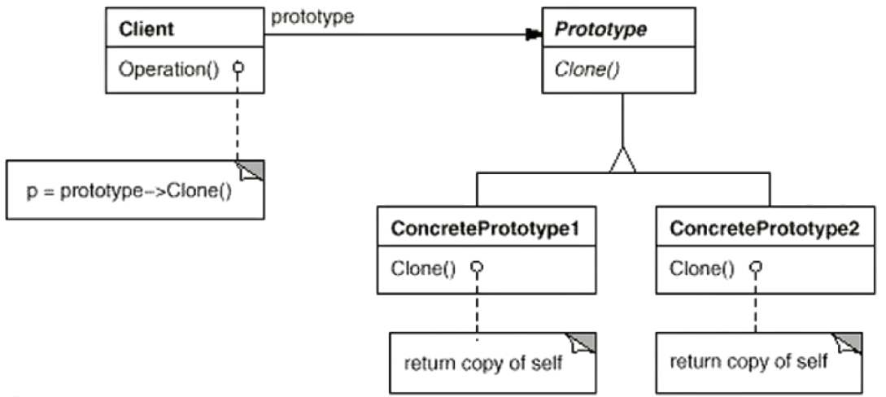

### 动机

* 在软件系统中，经常需要**创建“某些结构复杂的对象”**；由于需求的变化，**这些结构复杂的对象经常发生剧烈变化但却拥有比较稳定的接口**。
* 如何应对这种变化？如何**向“客户程序（使用这些对象的程序）”隔离出“这些易变对象”，从而使得“依赖这些易变对象的客户程序”不随着需求改变而改变**？

### 案例

* 案例：主窗口与文件分割器，每次点击按钮都会创建新的对象

### 模式定义

* 使用原型实例指定创建对象的种类，然后通过拷贝原型来创建新的对象

### 模式结构

* 文件分割器有个prototype虚基类，其中有虚函数clone和operation，然后其它子类实现这两个虚方法。主窗口组合了1个prototype指针，通过多态实现不同类型分割器的拷贝和operation
* 注：将工厂模式里的业务虚基类和工厂虚基类合并为原型，将工厂子类创建子类具体对象的方法改为clone（深克隆，利用拷贝构造函数克隆自己），其它处首先得到该原型对象，然后克隆该原型对象

### 要点总结

* Prototype模式同样用于隔离类对象的使用者和具体类型（易变类）之间的耦合关系，它同样要求这些“易变类”拥有“稳定的接口”。
* Prototype模式对于“如何创建易变类的实体对象”采用“原型克隆”的方法来做，它使得我们可以非常灵活地动态创建“拥有某些稳定接口”的新对象——所需工作仅仅是注册一个新类的对象（即原型），然后在任何需要的地方Clone。
* Prototype模式中的Clone方法可以利用某些框架中的序列化来实现深拷贝。
* 注
  * 和工厂方法的差别：工厂模式里是通过new来创建对象，对象结构比较简单时，new一个对象是简单的。当对象结构非常复杂时，new一个对象就没那么简单了。或者说对象初始化后的状态可能不是我们想要的状态，所以new+初始化也不那么好用，这时反而可能是你有1个对象已经达到我们想要的状态。所以可以基于拷贝构造函数、利用原型模式复制1个原型创建一个对象。
  * clone方法除了可以使用拷贝构造函数，对于一些语言还可以使用序列化进行深拷贝

### 代码

https://github.com/chouxianyu/design-patterns-cpp/tree/master/Prototype
