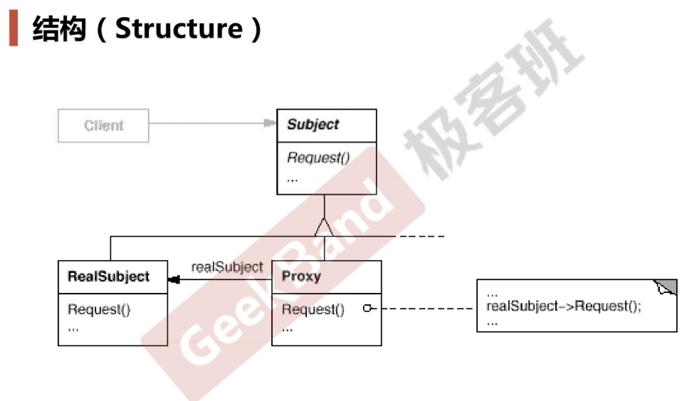

### 动机

* 在面向对象系统中，有些对象由于某种原因(比如对象创建的开销很大，或者某些操作需要安全控制，或者需要进程外的访问等)，直接访问会给使用者、或者系统结构带来很多麻烦。
* 如何 **在不失去透明操作对象的同时来管理/控制这些对象特有的复杂性** ？**增加一层间接层**是软件开发中常见的解决方式。

### 模式定义

* 为其它对象提供一种代理以控制（隔离，使用接口）对这个对象的访问

### 结构

### 要点总结

* “增加一层间接层”是软件系统中对许多复杂问题的一种常见解决方法。在面向对象系统中，直接使用某些对象会带来许多问题，作为间接层的proxy对象便是解决这一问题的常用手段。
* 具体proxy模式的实现方法、实现粒度都相差很大，有些可能对单个对象做细粒度的控制，比如copy-on-write技术（比如字符串类经常会使用该技术，这里讲了字符串类如何使用，但我没听懂），有些可能对组件模块提供抽象代理层，在架构层次对对象做proxy（分布式系统中有很多的proxy模式）
* proxy并不一定要求接口完整的一致性，有时候损失一些透明性是可以接受的

### 代码

https://github.com/chouxianyu/design-patterns-cpp/tree/master/Proxy
