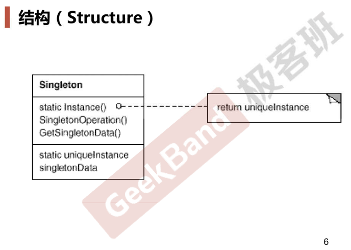

### 动机

* 在软件系统中，经常有这样一些特殊的类，必须保证它们在系统中只存在1个实例，才能确保它们的逻辑正确性以及良好的效率
* 如何绕过常规的构造器，提供一种机制来保证一个类只有一个实例？
* 这是类设计者的责任而非使用者的责任

### 案例

多线程环境下

* 简单的if判断无法保证线程安全
* 用lock的话虽然逻辑正确但代价又过高（每个线程都要获取锁才可以，但其实读取该单例对象时不需要锁，多个线程可以同时读取，只有某个线程要“写”该单例对象的时候才需要通过锁防止其它线程访问该单例对象）
* 双检查锁，该单例对象不存在时才加lock，获取lock之后再次判断该单例对象是否存在，不存在则创建该单例对象。这时的问题是，内存读写会出现reorder的情况，原因是线程是在CPU指令级别上抢时间的，源代码中的一行代码经过编译优化后得到的多个指令可能会被reorder（比如我们想象中创建对象的步骤是申请内存、内存初始化、返回内存地址并赋值给对应指针，但编译优化后的步骤可能是申请内存、返回内存地址并赋值给对应指针、内存初始化），这样的话就可能乱套，比如虽然指针不是nullptr但内存还未被初始化，那此时释放锁后如果其它进程来读这个内存，会读取到未初始化的值
* C++11版本之后的跨平台实现：atomic

### 模式定义

* 保证一个类仅有一个实例，并提供一个该实例的全局访问点

### 结构

### 要点总结

* Singleton模式中的实例构造器可以设置为protected，以允许子类派生
* Singleton偶数一般不要支持拷贝构造函数和clone接口，因为这有可能导致有多个对象实例，违背了Singleton模式的初衷
* 如何实现多线程环境下安全的Singleton？注意对双检查锁的正确实现

### 代码

https://github.com/chouxianyu/design-patterns-cpp/tree/master/Singleton

