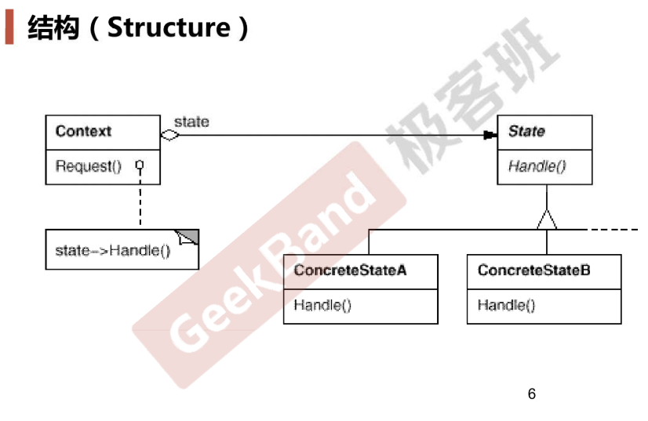

# State

## 动机

* 在软件构建过程中，某些**对象的状态如果改变，其行为也会随之改变**，比如文档处于只读状态，其支持的行为和读写状态支持的行为就可能完全不同
* 如何**在运行时根据对象的状态来透明地更改对象的行为**？而不会为对象操作和状态转换之间引入紧耦合？

## 案例

* 网络应用，网络有不同状态（打开、关闭、连接）
  * 如果用enum和if else（这个bad smell就类似于策略模式），违反了开闭原则，比如如果新增了一个状态怎么办呢？
  * 思路：定义State基类，把所有和状态相关的操作封装起来
* 虚函数就是运行时的if else
* 注：我个人感觉，设计模式的实现手法其实都是组合、继承、多态，不同模式只是动机和场景不同而已，所以面对新的场景时可以基于固定的实现手法根据设计原则进行设计

## 模式定义

* 允许一个对象在其内部状态改变时改变它的行为，从而使对象看起来似乎修改了其行为

## 结构

* 和策略模式很像

## 要点总结

* State模式**将所有与1个特定状态相关的行为都放入1个State子类对象中**，在对象状态切换时，切换相应的对象；但同时维持State的接口，这样实现了具体操作与状态转换之间的解耦
* 为不同的状态引入不同的对象使得状态转换更加明确，而且可以保证不会出现状态不一致的情况，因为转换是原子性的，即要么彻底转换过来，要么不转换
* 如果State对象没有实例变量，那么上下文可以共享同一个State对象，从而节省对象开销

## 代码

[https://github.com/chouxianyu/design-patterns-cpp/tree/master/State](https://github.com/chouxianyu/design-patterns-cpp/tree/master/State)
