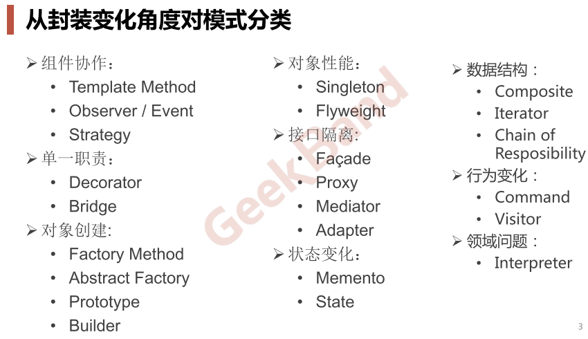

# Taxonomy

## 从封装变化角度对设计模式的分类

* **“组件协作”模式** ：现代软件专业分工之后的第一个结果是“框架与应用程序的划分”，“组件协作”模式通过晚期绑定，来实现框架与应用程序之间的松耦合，是二者之间协作时常用的模式。
  * [Template Method](./TemplateMethod.md)
  * [Observer / Event](./Observer.md)
  * [Strategy](./Strategy.md)
* **“单一职责”模式：** 在软件组件的设计中，如果责任划分的不清晰，使用继承得到的 结果往往是随着需求的变化，子类急剧膨胀，同时充斥着重复代码， 这时候的关键是划清责任
  * [Decorator](./Decorator.md)
  * [Bridge](./Bridge.md)
* **“对象创建”模式** ：绕开“new”来避免对象创建（new）过程 中所导致的紧耦合（编译时依赖具体实现类），从而支持对象创建的稳定。它是接口抽象之后的第一步工作
  * [Factory](./Factory.md)
  * [Abstract Factory](./AbstractFactory.md)
  * [Prototype](./Prototype.md)
  * [Builder](./Bulider.md)
* **“对象性能”模式** ：面向对象很好地解决了“抽象”的问题，但是不可避免地要付出一定的代价。对于通常情况来讲，面向对象的成本大都可以忽略不计。但是某些情况，面向对象所带来的成本必须谨慎处理。
  * [Singleton](./Singleton.md)
  * [Flyweight](./Flyweight.md)
* **“接口隔离”模式** ：在组件构建过程中，某些接口之间直接的依赖常常会带来很多问题、甚至根本无法实现。采用添加一层稳定/间接（微观上比如指针，宏观上比如操作系统、虚拟机、依赖倒置原则）接口，来隔离本来互相紧密关联的接口是一种常见的解决方案
  * [Facade](./Facade.md)
  * [Proxy](./Proxy.md)
  * [Adapter](./Adapter.md)
  * [Mediator](./Mediator.md)
* **“状态变化”模式** ：在组件构建过程中，某些对象的状态经常会变化，如何对这些变化进行有效地管理？同时又维持高层模块的稳定？
  * [State](./State.md)
  * [Memento](./Memento.md)
* **“数据结构”模式** ：一些组件在内部具有特定的数据结构，如果让客户程序依赖这些特定的数据结构，将极大地破坏组件的复用。将这些特定数据结构封装在内部，在外部提供统一的接口，来实现与特定结构无关的访问，是一种行之有效的解决方案
  * [Composite](./Composite.md)
  * [Iterator](./Iterator.md)
  * [Chain of Responsibility](./ChainOfResponsibility.md)
* **“行为变化”模式** ：在组件的构建过程中，组件行为的变化经常导致组件本身剧烈的变化。“行为变化”模式将组件的行为和组件本身进行解耦，从而支持组件行为的变化，实现两者之间的松耦合
  * [Command](./Command.md)
  * [Visitor](./Visitor.md)
* **“领域规则”模式** ：在特定领域中，某些变化虽然频繁，但可以抽象为某种规则。这时候，结合特定领域，将问题抽象为语法规则，从而给出在该领域下的一般性解决方案。
  * [Interpreter](./Interpreter.md)

## GOF对设计模式的分类

* **创建型（Creational）模式** ： **将对象的部分创建工作延迟到子类或者其他对象** ，从而应对需求变化为对象创建时具体类型实现引来的冲击。
  * 工厂模式（Factory）
  * 抽象工厂模型（Abstract Factory）
  * 构建器模式（Builder）
  * 原型模式（Prototype）
  * 单例模式（Singleton）
* **结构型（Structural）模式** ：通过类继承或者对象组合获得 **更灵活的结构** ，从而应对需求变化为对象的结构带来的冲击。
  * 门面模式（Facade）
  * 适配器模式（Adapter）
  * 代理模式（Proxy）
  * 装饰模式（Decorator）
  * 桥模式（Bridge）
  * 组合模式（Composite）
  * 享元模式（Flyweight）
* **行为型（Behavioral）模式** ：通过类继承或者对象组合来 **划分类与对象间的职责** ，从而应对需求变化为多个交互的对象带来 的冲击。
  * 模板方法模式（Template Method）
  * 观察者模式（Observer）
  * 状态模式（State）
  * 策略模式（Strategy）
  * 职责链模式（Chain of Responsibility）
  * 命令模式（Command）
  * 访问者模式（Visitor）
  * 中介者模式（Mediator）
  * 备忘录模式（Memento）
  * 迭代器模式（Iterator）
  * 解释器模式（Interpreter）