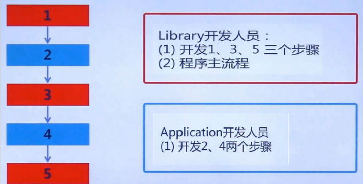
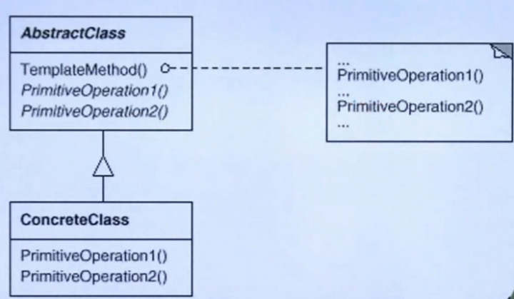

# TemplateMethod

## 动机

* 在软件构建过程中，对于某一项任务，它常常有**稳定的整体操作结构，但各个子步骤却有很多改变的需求**，或者由于固有的原因 （比如**框架与应用**之间的关系）**子步骤无法和任务的整体结构同时实现。**
* 如何**在确定稳定操作结构的前提下，来灵活应对各个子步骤的变化或者晚期实现需求**？

## 模式定义

* 定义一个操作中的**算法的骨架 (稳定)，而将一些步骤延迟 (变化)到子类中**。Template Method使得子类可以不改变 (复用)一个算法的结构即可重定义(override 重写)该算法的某些特定步骤。
* 注：稳定的代码由基类和模板方法实现，变化的代码通过晚绑定和多态由子类实现

## 模式结构

## 要点总结

* Template Method是一种非常基础性的设计模式，在面向对象系统中有着大量的应用。它用最简洁的机制（虚函数的多态性） 为很多应用程序框架提供了灵活的扩展点，是代码复用方面的基本实现结构。
* 除了可以灵活应对子步骤的变化外，“不要调用我，让我来调用你”的反向控制结构是Template Method的典型应用。
* 在具体实现方面，被Template Method调用的虚方法可以具有实现，也可以没有任何实现（抽象方法、纯虚方法），但一般推荐将它们设置为protected方法。
* 注：这个模式更多地是从library的角度而非application的角度来思考的

## 代码

https://github.com/chouxianyu/design-patterns-cpp/tree/master/TemplateMethod
